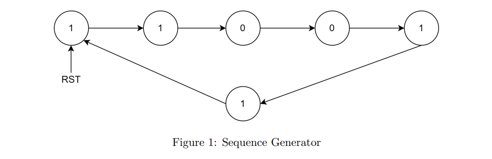

# Sequence Generator
EE214 - Digital Circuits Lab

## Features

* Generates the sequence 1 1 0 0 1 1 . 
* Written in structural-dataflow modeling .
* Reset is asynchronous in nature i.e. reset effects the output sequence irrespective of the input clock arrival.
* On Reset, sequence start from the first ’1’.
* Unused states are mapped to one of the known state which is reset state.

## Author
- [@Pratik Yabaji](https://pratik-yabaji.github.io/Portfolio/)